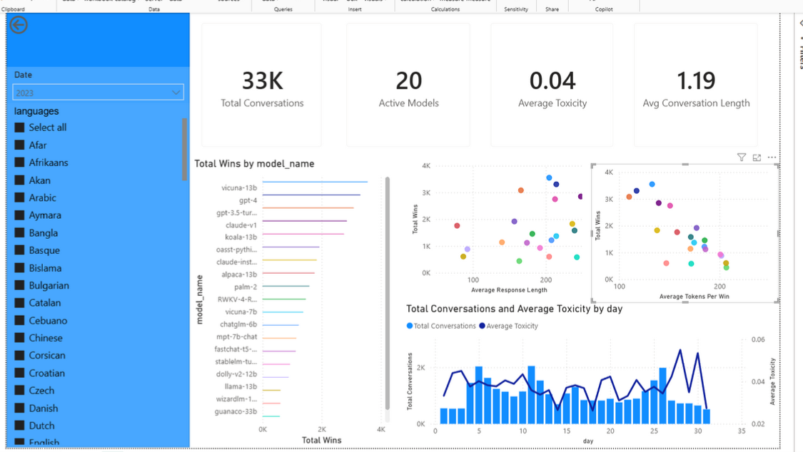

# LLM Benchmarking: From Raw Telemetry to Power BI Dashboard

## Chapter 1: Executive Summary

### Project Objective
To architect a data pipeline and reporting semantic model that identifies the optimal Large Language Model (LLM) for enterprise deployment[cite: 1]. The evaluation framework strictly balances three operational vectors: user satisfaction (win rate), safety compliance (toxicity risk), and operational efficiency (estimated API token cost)[cite: 1].

### Bottom-Line Results
This infrastructure transforms nested, raw parquet telemetry logs into an optimized, query-ready relational matrix[cite: 1]. It enables enterprise decision-makers to definitively answer whether paying a premium in token costs yields a statistically significant increase in human preference, and whether "winning" models achieve their rank by bypassing vital safety guardrails[cite: 1].

### Deliverable
A fully automated ETL pipeline extracting data from nested structures, loading it into a PostgreSQL Enterprise Star Schema, and surfacing the telemetry via a multidimensional Power BI dashboard[cite: 1].

---

## Chapter 2: The Dataset & Business Questions

### The Raw Data (`0000.parquet`)
The source telemetry consists of semi-structured parquet data capturing head-to-head model evaluations[cite: 1]. Critical analytical metrics are buried within JSON structs[cite: 1]:

```json
{
  "question_id": "VARCHAR: Unique alphanumeric identifier for the specific conversation/battle.",
  "model_a": "VARCHAR: Name of the first AI model competing.",
  "model_b": "VARCHAR: Name of the second AI model competing.",
  "winner": "VARCHAR: The outcome of the battle based on the judge's vote ('model_a', 'model_b', or 'tie').",
  "judge": "VARCHAR: Unique identifier for the human user who evaluated the models.",
  "conversation_a": [
    {
      "content": "VARCHAR: The actual text of the message.",
      "role": "VARCHAR: The speaker of the message ('user' for the human prompt, 'assistant' for the AI response)."
    }
  ],
  "conversation_b": [
    {
      "content": "VARCHAR: The actual text of the message.",
      "role": "VARCHAR: The speaker of the message ('user' for the human prompt, 'assistant' for the AI response)."
    }
  ],
  "turn": "BIGINT: The number of back-and-forth exchanges in the conversation.",
  "anony": "BOOLEAN: True/false flag indicating if the model names were hidden from the judge during the test.",
  "language": "VARCHAR: The language used in the prompt and response.",
  "tstamp": "DOUBLE: Unix epoch timestamp recording exactly when the interaction occurred.",
  "openai_moderation": {
    "categories": "STRUCT: Boolean flags indicating if the text violates specific OpenAI safety categories.",
    "category_scores": "STRUCT: Decimal probability scores for each safety category.",
    "flagged": "BOOLEAN: Overall flag indicating if the response was marked as unsafe by the moderation API."
  },
  "toxic_chat_tag": {
    "roberta-large": {
      "flagged": "BOOLEAN: Indicating if the 'roberta-large' model flagged the text as toxic.",
      "probability": "DOUBLE: Decimal probability score of toxicity from the 'roberta-large' model."
    },
    "t5-large": {
      "flagged": "BOOLEAN: Indicating if the 't5-large' model flagged the text as toxic.",
      "score": "DOUBLE: Decimal toxicity score from the 't5-large' model."
    }
  }
}
```

### The Core Business Questions
The architecture resolves three specific analytical angles[cite: 1]:

**1. Model Performance & User Preference (The Quality Angle)**
This is about figuring out which AI is actually the smartest and most helpful for users[cite: 1].
*   Which LLM has the highest overall win rate? (Who is the undisputed champion of the arena?)[cite: 1]
*   Does the winning model change based on the language? (e.g., Maybe an open-source model beats ChatGPT in English, but loses completely in French or Spanish)[cite: 1].
*   How does performance hold up in long conversations? (Look at the turn column. Do certain models win on the first prompt but start failing when the conversation reaches 3 or 4 turns?)[cite: 1]

**2. Trust, Safety, & Brand Risk (The Security Angle)**
Companies are terrified of deploying an AI that says something offensive[cite: 1]. This is where you use the `openai_moderation` and `toxic_chat_tag` data[cite: 1].
*   Which model carries the highest toxicity risk? (Which model consistently scores the highest probability of generating flagged or harassing content?)[cite: 1]
*   Is there a correlation between toxicity and winning? (This is a fascinating data science question: Do human judges accidentally vote for the more "toxic" or aggressive model because it sounds more confident?)[cite: 1]

**3. FinOps & API Efficiency (The Cost Angle)**
This is where you show off your backend infrastructure mindset[cite: 1]. You aren't just looking at who won; you are looking at what it cost to win[cite: 1].
*   What is the estimated token cost of the winning models? (Using the word count of `conversation_a` and `conversation_b`, which model uses the most tokens per response?)[cite: 1]
*   Is there a "verbosity bias"? (Do models win simply because they output longer, more expensive responses, even if a shorter response would have been just as good?)[cite: 1]

---

## Chapter 3: Data Quality & Star Schema Implementation

Before designing the warehouse, rigorous SQL validation checks were executed on the raw parquet file using DuckDB to identify anomalies and pipeline requirements[cite: 1].

### Data Profiling & Anomaly Detection Results

**1. The Null Value Sweep**
This query checks your most critical columns for missing data in a single pass[cite: 1]. It counts exactly how many rows are missing primary keys, model names, or moderation scores[cite: 1].

```sql
SELECT
  SUM(CASE WHEN question_id IS NULL THEN 1 ELSE 0 END) AS missing_ids,
  SUM(CASE WHEN model_a IS NULL OR model_b IS NULL THEN 1 ELSE 0 END) AS missing_models,
  SUM(CASE WHEN winner IS NULL THEN 1 ELSE 0 END) AS missing_winners,
  SUM(CASE WHEN toxic_chat_tag IS NULL THEN 1 ELSE 0 END) AS missing_toxicity_scores,
  SUM(CASE WHEN conversation_a IS NULL THEN 1 ELSE 0 END) AS missing_conversations
FROM '0000.parquet';
```
*   **Why it matters:** If `question_id` is null, your Fact table will break[cite: 1]. If `toxic_chat_tag` is null, your safety metrics will be skewed[cite: 1]. This tells you exactly which rows you need to drop in your ETL pipeline[cite: 1].

```text
| missing_ids | ... | missing_toxicity_s... | missing_conversati... |
|-------------|-----|-----------------------|-----------------------|
| 0           | ... | 0                     | 0                     |
```

**2. Primary Key Integrity (Duplicate Hunting)**
A strict rule of relational databases is that your primary key must be 100% unique[cite: 1]. This query groups the data by `question_id` and flags any ID that appears more than once[cite: 1].

```sql
SELECT
  question_id,
  COUNT(*) as frequency
FROM '0000.parquet'
GROUP BY question_id
HAVING COUNT(*) > 1
ORDER BY frequency DESC;
```
*   **Why it matters:** If this query returns any rows, it means you have duplicate battles in your dataset[cite: 1]. You will need to add a deduplication step (like a `SELECT DISTINCT`) to your pipeline before pushing to PostgreSQL[cite: 1].

```text
| question_id                      | frequency |
|----------------------------------|-----------|
| 08003723f24740a6bdb547a10e70cad9 | 3         |
| 1769dd8f84964d7ebf9953e842f9f7b3 | 2         |
| c6192fdbd3dd46c98791d7abac92b56d | 2         |
... (19 rows total)
```

**3. Categorical Integrity (Domain Validation)**
The winner column should strictly contain specific outcomes[cite: 1]. If your data scraping accidentally pulled in garbage text, it will ruin your Power BI charts[cite: 1]. This query groups the winners to ensure no unexpected values exist[cite: 1].

```sql
SELECT
  winner,
  COUNT(*) as total_occurrences
FROM '0000.parquet'
GROUP BY winner
ORDER BY total_occurrences DESC;
```
*   **Why it matters:** You expect to see "model_a", "model_b", "tie", and maybe "tie (bothbad)"[cite: 1]. If you see a row where the winner is "user_error" or a random string of numbers, you have identified a data anomaly that your ETL pipeline must filter out[cite: 1].

```text
| winner        | total_occurrences |
|---------------|-------------------|
| model_a       | 11744             |
| model_b       | 11550             |
| tie (bothbad) | 6263              |
| tie           | 3443              |
```

**4. Structural Integrity (Testing the Nested Structs)**
Because your safety data is buried in a complex struct, you need to ensure the nested fields actually contain valid decimal probabilities, not unexpected strings or negatives[cite: 1].

```sql
SELECT
  MIN(toxic_chat_tag."roberta-large".probability) as min_toxicity,
  MAX(toxic_chat_tag."roberta-large".probability) as max_toxicity
FROM '0000.parquet'
WHERE toxic_chat_tag IS NOT NULL;
```
*   **Why it matters:** Probabilities must strictly exist between 0.0 and 1.0[cite: 1]. If your MAX comes back as 99.9 or your MIN comes back as -1.5, you have corrupted telemetry data that needs to be normalized[cite: 1].

```text
| min_toxicity        | max_toxicity       |
|---------------------|--------------------|
| 0.00650737015530467 | 0.8937399387359619 |
```

### The Enterprise Star Schema Database Definition
Based on the profiling, the data is normalized into the following Star Schema to optimize DAX aggregations[cite: 1].

#### The Dimension Tables
*   `Dim_Model`: `Model_ID`, `Model_Name` (e.g., "chatglm-6b")[cite: 1].
*   `Dim_Date`: `Date_ID`, `Year`, `Month`, `Day`, `Quarter`[cite: 1].
*   `Dim_Judge`: `Judge_ID`, `Judge_Hash` (Anonymized user IDs)[cite: 1].
*   `Dim_Language`: `Language_ID`, `Language_Name`[cite: 1].
*   `Dim_Safety_Profile` (The Junk Dimension): `Safety_Profile_ID`, `Is_Harassment` (T/F), `Is_Hate` (T/F), `Is_Violence` (T/F), `Is_Flagged_Overall` (T/F)[cite: 1].

#### The Fact Table

| Column Name | Type | Notes |
| :--- | :--- | :--- |
| `Battle_ID` | FK | Links to Dim_Conversation[cite: 1]. |
| `Date_ID` | FK | Links to Dim_Date[cite: 1]. |
| `Judge_ID` | FK | Links to Dim_Judge[cite: 1]. |
| `Model_A_ID` | FK | Links to Dim_Model (Role 1)[cite: 1]. |
| `Model_B_ID` | FK | Links to Dim_Model (Role 2)[cite: 1]. |
| `Language_ID` | FK | Links to Dim_Language (e.g., English, Spanish)[cite: 1]. |
| `Safety_Profile_ID`| FK | Links to Dim_Safety_Profile[cite: 1]. |
| `Winner` | Text | 'model_a', 'model_b', or 'tie'[cite: 1]. |
| `Turn_Count` | Number | Measure: Average conversation length[cite: 1]. |
| `Toxicity_Score_A` | Decimal | Measure: roberta-large score for Model A[cite: 1]. |
| `Toxicity_Score_B` | Decimal | Measure: roberta-large score for Model B[cite: 1]. |
| `Est_Tokens_A` | Number | Measure: Your engineered token count[cite: 1]. |
| `Est_Tokens_B` | Number | Measure: Your engineered token count[cite: 1]. |

#### PostgreSQL DDL Scripts

```sql
-- ====================================================================
-- 1. DIMENSION TABLES (Create these first to establish Primary Keys)
-- ====================================================================
CREATE TABLE IF NOT EXISTS dim_model (
  model_id SERIAL PRIMARY KEY,
  model_name VARCHAR(100) UNIQUE NOT NULL
);

CREATE TABLE IF NOT EXISTS dim_date (
  date_id INT PRIMARY KEY,
  year INT NOT NULL,
  month INT NOT NULL,
  day INT NOT NULL,
  quarter INT NOT NULL
);

CREATE TABLE IF NOT EXISTS dim_judge (
  judge_id SERIAL PRIMARY KEY,
  judge_hash VARCHAR(255) UNIQUE NOT NULL
);

CREATE TABLE IF NOT EXISTS dim_language (
  language_id SERIAL PRIMARY KEY,
  language_name VARCHAR(50) UNIQUE NOT NULL
);

CREATE TABLE IF NOT EXISTS dim_safety_profile(
  safety_profile_id SERIAL PRIMARY KEY,
  is_harassment BOOLEAN NOT NULL,
  is_hate BOOLEAN NOT NULL,
  is_violence BOOLEAN NOT NULL,
  is_flagged_overall BOOLEAN NOT NULL,
  UNIQUE (is_harassment, is_hate, is_violence, is_flagged_overall)
);

-- ====================================================================
-- 2. FACT TABLE (Created last to establish Foreign Key constraints)
-- ====================================================================
CREATE TABLE IF NOT EXISTS fact_model_evaluations (
  battle_id VARCHAR(255) PRIMARY KEY,
  date_id INT REFERENCES dim_date(date_id),
  judge_id INT REFERENCES dim_judge(judge_id),
  model_a_id INT REFERENCES dim_model(model_id),
  model_b_id INT REFERENCES dim_model (model_id),
  language_id INT REFERENCES dim_language (language_id),
  safety_profile_id INT REFERENCES dim_safety_profile(safety_profile_id),
  winner VARCHAR(50) NOT NULL,
  turn_count INT NOT NULL,
  toxicity_score_a DECIMAL(10, 6),
  toxicity_score_b DECIMAL (10, 6),
  est_tokens_a INT,
  est_tokens_b INT
);
```

---

## Chapter 4: The ETL Pipeline & Power BI Dashboard

### Architectural Workaround: The JSON Conversion Strategy
Native parsing of highly nested parquet files can introduce paging and schema-inference bottlenecks in Pentaho Data Integration (Spoon)[cite: 1]. To ensure a resilient and high-throughput data flow, the raw Parquet telemetry was pre-processed and flattened into JSON[cite: 1]. This decouples the extraction complexity from the transformation engine, allowing Pentaho's JSON Input step to reliably parse the conversational arrays and nested moderation structs without memory faults[cite: 1].

### The Pentaho (Spoon) ETL Data Flow
The data integration pipeline executes a strict Kimball-aligned loading sequence, handling deduplication, surrogate key generation, and fact table population in a single orchestrated pass[cite: 1].

1.  **Extraction & Error Handling**
    *   **Text file input & JSON input:** The pipeline ingests the pre-processed JSON data[cite: 1].
    *   **Error Routing (Dummy Step):** A critical error-handling hop (red dotted line) is configured from the JSON input to a Dummy (do nothing) step[cite: 1]. This ensures that any malformed JSON telemetry from the web scrapers drops out of the stream gracefully without crashing the entire batch execution[cite: 1].
2.  **Deduplication (Addressing the Primary Key Anomaly)**
    *   **Sort rows -> Unique rows:** Directly addressing the 19 redundant `question_id` primary keys identified during the SQL Data Profiling phase[cite: 1]. The stream is sorted and duplicate hashes are stripped out, guaranteeing 100% Primary Key integrity before reaching the database[cite: 1].
3.  **Transformation & Metric Engineering**
    *   **Modified JavaScript value:** This component executes the row-level business logic[cite: 1]. It flattens the conversational text arrays and calculates the engineered FinOps metric: multiplying the word count by 1.3 to output `Est_Tokens_A` and `Est_Tokens_B`[cite: 1].
    *   And creating the date attribute like year and month and day from row string[cite: 1].
4.  **Dimension Lookups (The Surrogate Key Pipeline)**
    *   The stream passes through sequential Combination Lookup/Update steps[cite: 1]. These steps check the PostgreSQL dimension tables; if a value (e.g., a specific language or model name) exists, it retrieves the integer ID[cite: 1]. If it is new, it inserts it and generates a new ID[cite: 1].
    *   Combination `model_a_id` & Combination `model_b_id`[cite: 1]
    *   Combination `judge_id`[cite: 1]
    *   Combination `language_id`[cite: 1]
    *   Combination `safety_profile_id`[cite: 1]

**Dynamic Date Dimension Generation:** To bypass timestamp extraction issues and ensure total temporal coverage, the `dim_date` table is populated using a programmatic sequence generation script[cite: 1]. This allows the Fact table to simply map its extracted `date_id` directly to this pre-populated dimension[cite: 1].

```sql
INSERT INTO dim_date (date_id, year, month, day, quarter)
SELECT
  TO_CHAR(datum, 'YYYYMMDD'):: INT AS date_id,
  EXTRACT(YEAR FROM datum) AS year,
  EXTRACT (MONTH FROM datum) AS month,
  EXTRACT (DAY FROM datum) AS day,
  EXTRACT (QUARTER FROM datum) AS quarter
FROM (
  -- This generates one row for every single day in the range
  SELECT generate_series('2023-01-01':: DATE, '2026-12-31'::DATE, '1 day':: interval) AS datum
) AS sequence
ON CONFLICT (date_id) DO NOTHING; -- Prevents errors if executed multiple times
```

5.  **Final Load**
    *   **Select values:** Prunes the heavy text fields and temporary pipeline variables, leaving only the clean Foreign Keys and numerical measures[cite: 1].
    *   **Table output:** Executes a bulk INSERT into the PostgreSQL `fact_model_evaluations` table[cite: 1].
[Pentaho ETL Pipeline](images/pipeline.png)
### The Power BI Semantic Model & Executive Dashboard
The presentation layer connects directly to the PostgreSQL Star Schema[cite: 1]. By leveraging the 1-to-Many relationships from the Dimension tables to the Fact table, the dashboard delivers high-speed dynamic filtering without heavy DAX overhead[cite: 1].

**Dashboard Component Breakdown:**
*   **Global Slicers (The Context Engine):** A left-hand navigation pane allows stakeholders to filter the entire model by Date (e.g., isolating 2023) and languages (supporting highly granular cuts, from Arabic to Basque)[cite: 1].
*   **Macro KPIs (The 10,000-Foot View):** Immediately establishes the arena's scale: 33K Total Conversations evaluated across 20 Active Models, with an incredibly low baseline Average Toxicity of 0.04[cite: 1].
*   **Quality Angle (Total Wins by model_name):** A horizontal bar chart acting as the definitive leaderboard[cite: 1]. Currently, open-weight models like `vicuna-13b` are competing aggressively with proprietary models like `gpt-4` and `gpt-3.5-turbo` for top human preference[cite: 1].
*   **Cost & Verbosity Angle (Scatter Matrices):** These scatter plots correlate Total Wins against Average Response Length and Average Tokens Per Win[cite: 1]. This visually isolates the models that are highly efficient (top-left quadrant: high wins, low token burn) from those suffering from "Verbosity Bias" (winning simply by generating massive, expensive walls of text)[cite: 1].

*   **Security Angle (Temporal Toxicity Tracking):** A bottom combo chart maps Total Conversations (bar volume) against Average Toxicity by day (line trajectory)[cite: 1]. This allows security teams to identify if sudden spikes in platform usage correlate with a breakdown in model safety guardrails[cite: 1].
